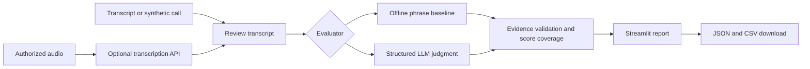

# CallLens — Voice Agent Evaluation

An independent portfolio prototype for reviewing voice-agent conversations. CallLens combines transcript intake, optional speech recognition, a transparent offline baseline, structured AI evaluation, evidence checks and exportable results.

## Run locally

Python 3.11 or newer is recommended. Open a terminal in this folder:

```sh
python3 -m venv .venv
source .venv/bin/activate
python -m pip install -r requirements.txt
python -m streamlit run app.py
```

On Windows, activate with `.venv\Scripts\activate`. The app opens at http://localhost:8501. Select the first synthetic call and click **Evaluate call**. No API key is needed for offline mode. The six examples are fictional and contain no employer/client recordings.

## Live mode

Choose **Live AI evaluation**, enter an OpenAI API key in the password field, confirm the data is authorized, then evaluate. Optional environment variables: `OPENAI_API_KEY`, `EVALUATION_MODEL`, `TRANSCRIPTION_MODEL`. Defaults are `gpt-4.1-mini` and `gpt-4o-mini-transcribe`; access depends on the account, and model IDs are editable. The app does not read a `.env` file automatically.

For audio, choose **Transcribe audio**, upload a supported recording up to 20 MB, and click **Transcribe recording**. Review the text and add speaker labels before evaluation. A reference transcript enables WER on the original transcription. These are separate actions so audio and text are not silently sent on every rerun.

## Architecture



- `evaluator.py`: baseline, quote validation, score coverage, WER, safe CSV output.
- `provider.py`: typed response schema, versioned rubric prompt, API timeouts and bounded retries.
- `app.py`: Streamlit interface and session-scoped results; hides stale reports when inputs change.
- `data/calls.json`: six authored regression scenarios with expected intent and outcome labels.
- `METHOD.md`: scoring definitions and measurement limits.

## Test

```sh
python -m unittest discover -s tests -v
```

The tests include Streamlit interactions and mocked API contracts. They do not spend API credits. A live end-to-end run with an authorized key and a real synthetic recording is still required before claiming that the live integration has been validated.

## Two-minute interview demonstration

1. **0:00–0:20:** “CallLens helps an implementation team inspect why a voice-agent call succeeded or failed. It does not make unsupported claims from missing evidence.”
2. **0:20–0:50:** Evaluate **Account access · confirmed fix**. Show the outcome quote and rubric coverage. Explain that the baseline is transparent and limited.
3. **0:50–1:15:** Evaluate **Billing · promise is not completion**. Explain why a promised refund remains unknown.
4. **1:15–1:35:** Run the synthetic benchmark. Show the contradiction and adversarial cases. Clarify that this small set is regression coverage, not production accuracy.
5. **1:35–2:00:** Show JSON export and the architecture. Discuss the live adapter, human review, next held-out experiment and what production integration would require.

## Project scope and development

Developed with AI coding assistance as an independent portfolio project. The sample calls are fictional; no employer code, customer records or client recordings are included.

This prototype focuses on evaluation and human review. It does not place calls, update CRM records or automate customer follow-ups. The offline workflow and mocked API contracts are covered by automated tests. Live API validation and a hosted demonstration remain future work.

## Official implementation references

- [OpenAI file transcription](https://developers.openai.com/api/docs/guides/speech-to-text)
- [OpenAI structured outputs](https://developers.openai.com/api/docs/guides/structured-outputs)

The score is a prototype review rubric, not an externally validated quality standard. See `METHOD.md` for limits, privacy boundaries and an evaluation plan.
